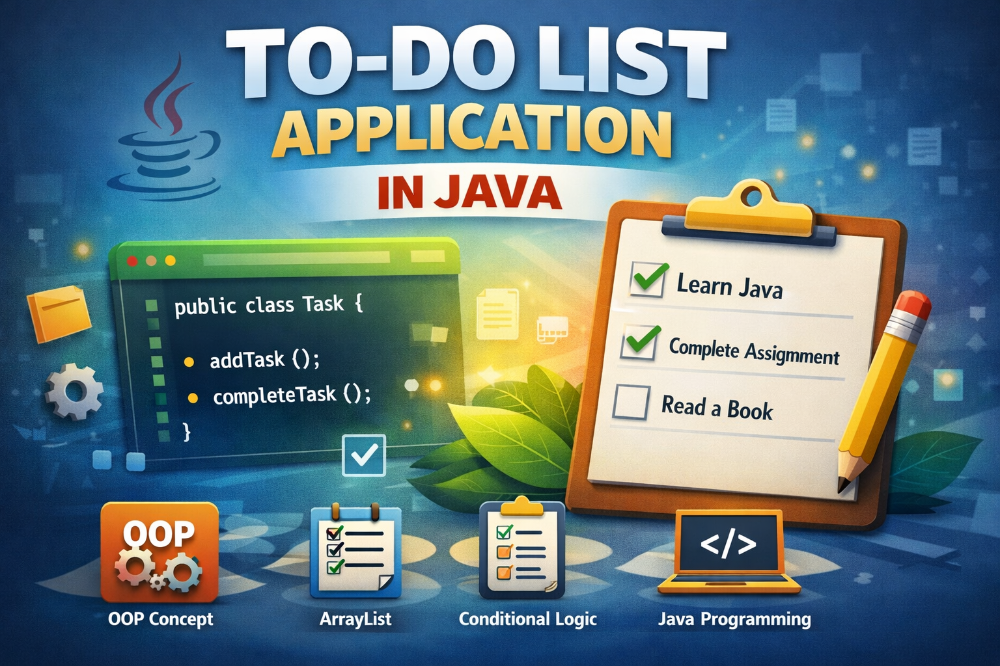

## To-Do List Application ##
## Project Overview ##
## i developed a console based to-do list application using core java.
this project allows users to manage daily tasks as completed.
the main objective of this project was to strengthen my understanding of:
-object-oriented programming
-class and object
-constrctor
-arraylist
-conditional statement
-method implementation

##Implementation Process:
the application should allow users to:
-add a task
-mark a task as completed
-display all tasks
-exit the application

## Create task class:
-I created a task class to represent each task .

##Implement core functionalities:
-add task
-mark task as completed
-display task 
-menu driven system

##Future Enhancements
-add delete task feature
-save tasks using file handling
-build gui using swing 
-convert web application using spring boot 
## Project Overview

